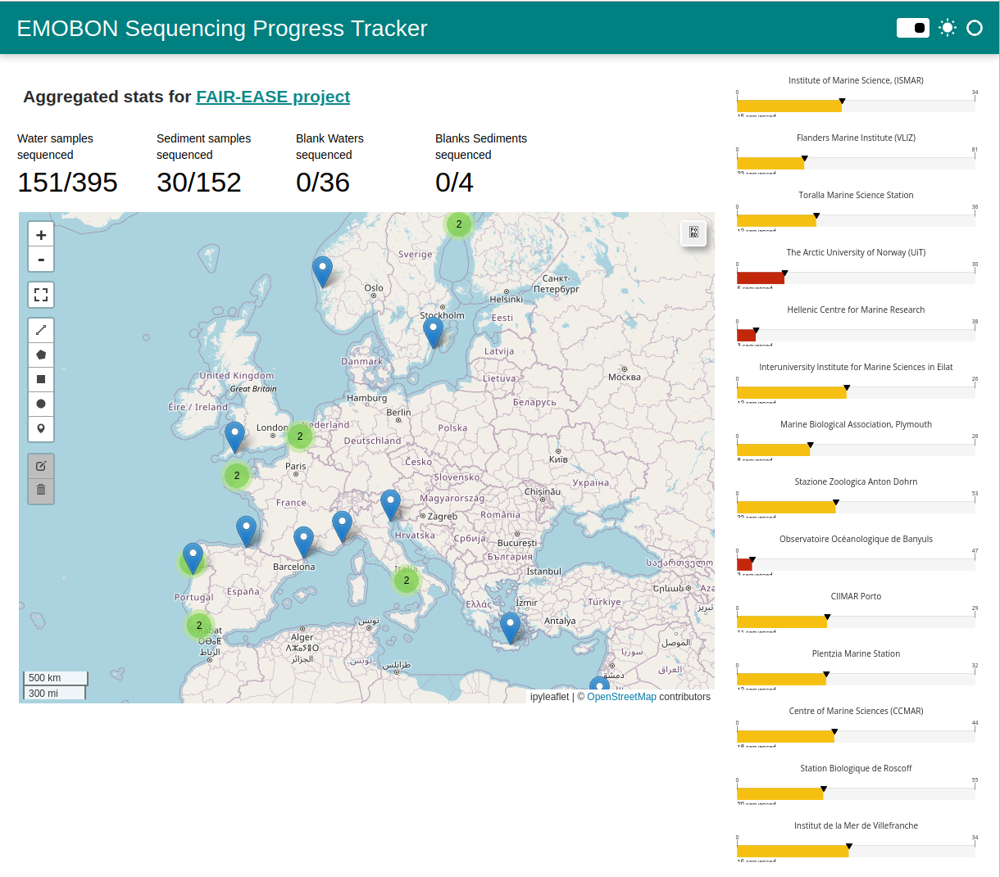
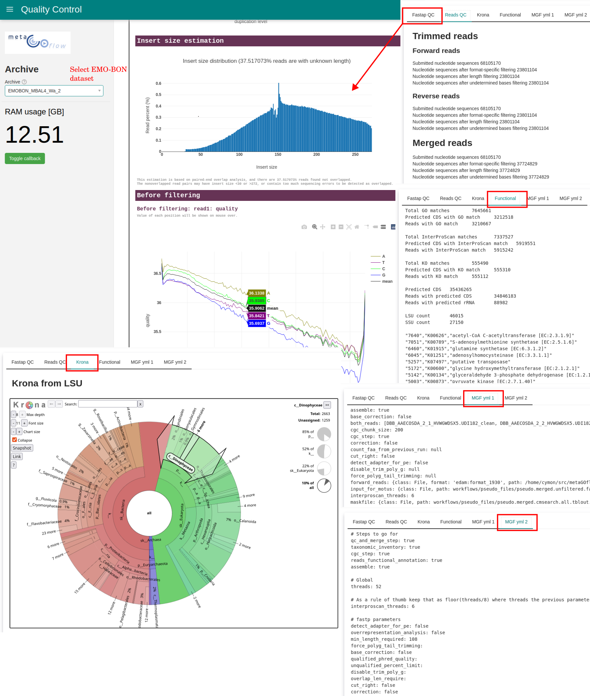
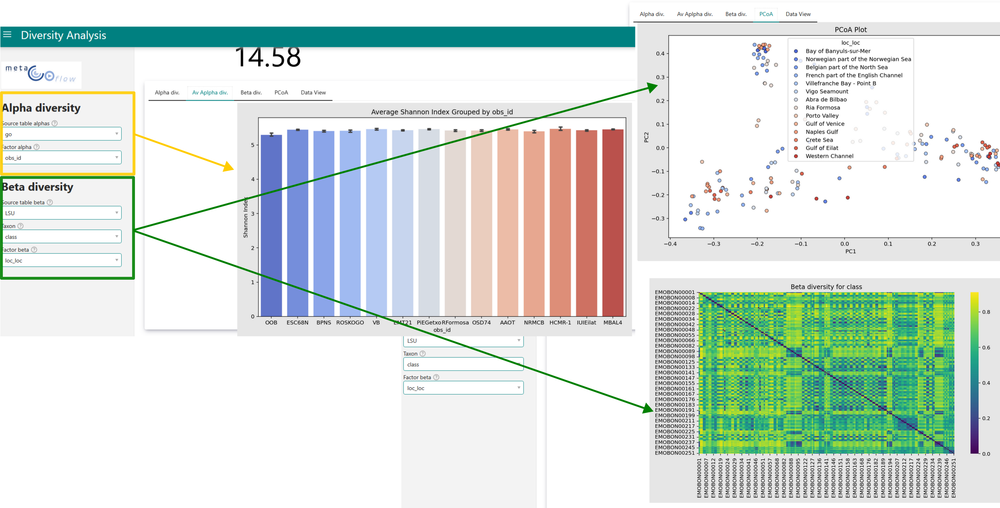
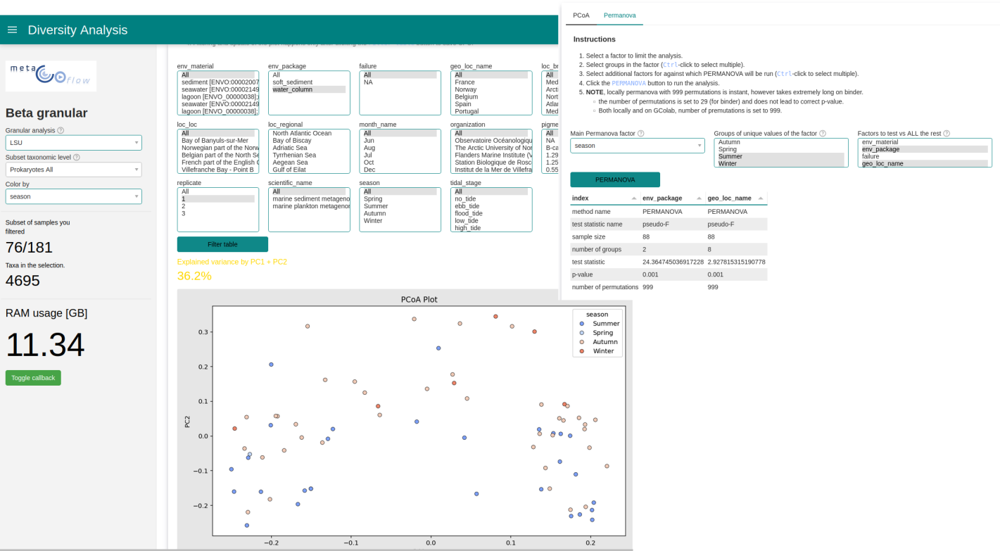
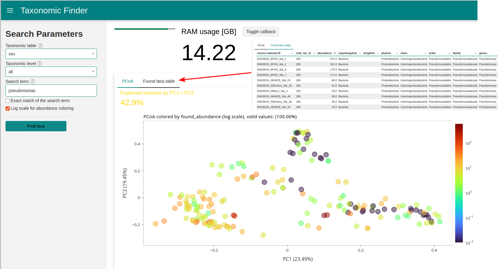
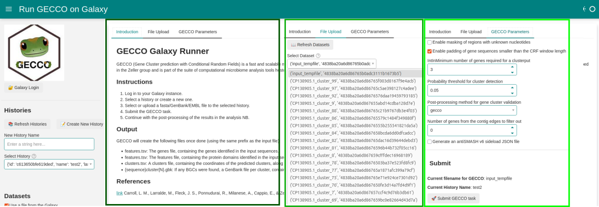
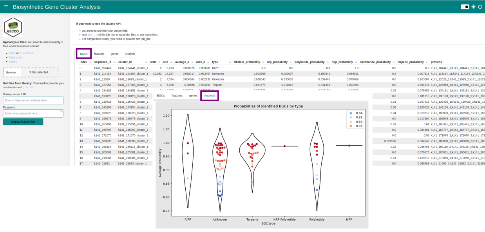
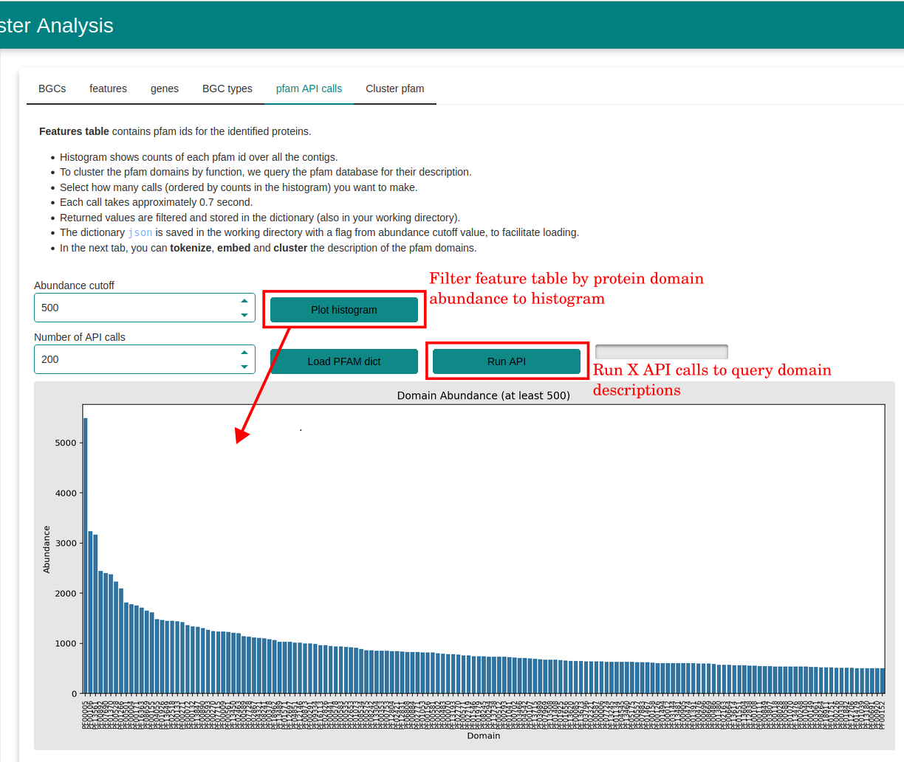
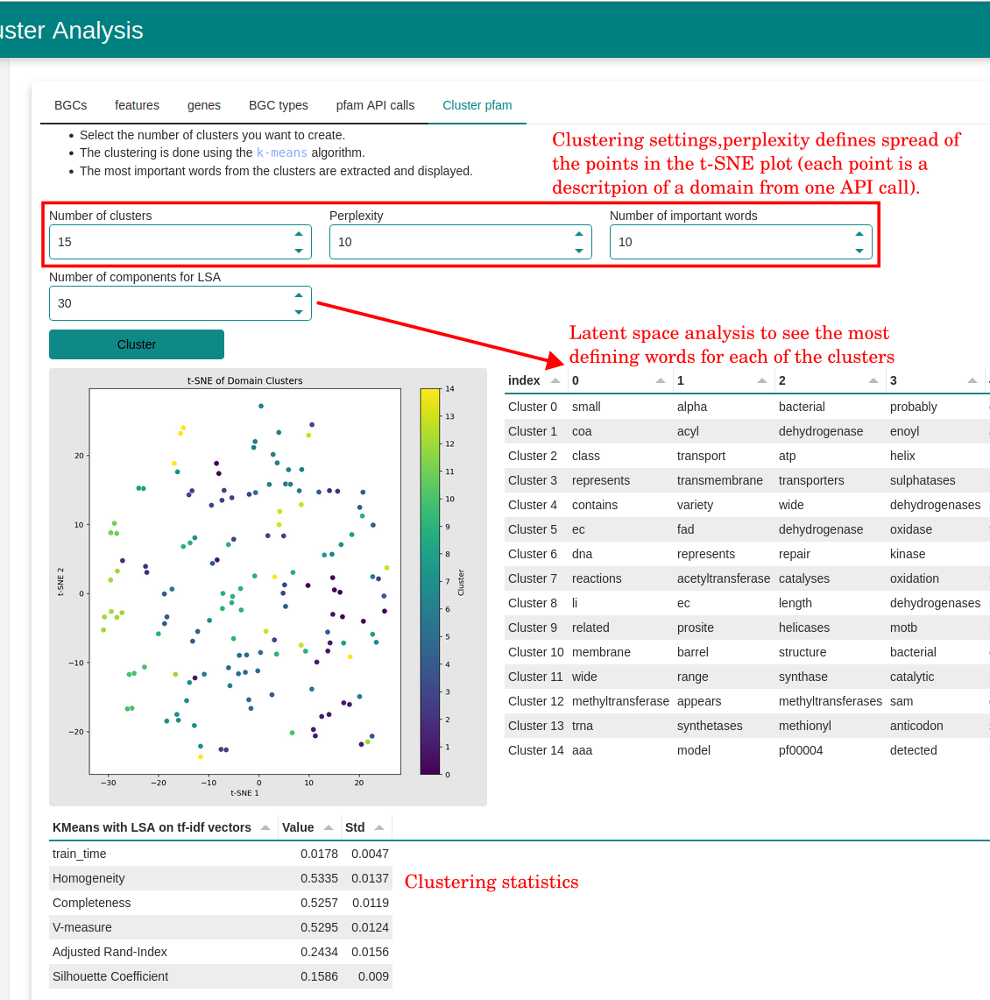
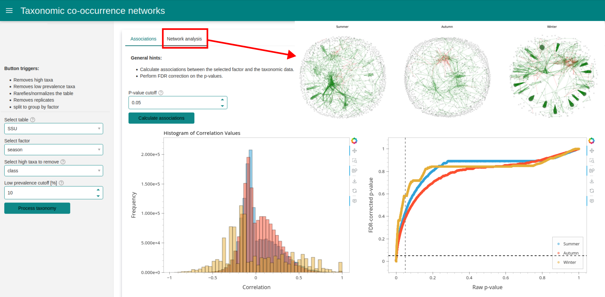

# Marine Omics Demos


[](https://mybinder.org/v2/gh/emo-bon/momics-demos/HEAD)
[](https://colab.research.google.com/github/palec87/momics-demos/)
[](https://github.com/emo-bon/momics-demos/actions)
[](https://codecov.io/gh/emo-bon/momics-demos)

Marine metagenomics platform NBs to get the science started. This work is part of [FAIR-EASE](https://fairease.eu/) project, specifically Pilot 5 for metagenomics to provide as many tools to for [emo-bon](https://data.emobon.embrc.eu/) data.

Having problems, encountered bugs, or developing ideas? Open [issues](https://github.com/emo-bon/momics-demos/issues) and PRs with your dream workflow suggestions.

## Table of Contents

- [Marine Omics Demos](#marine-omics-demos)
- [Design principles](#design-principles)
- [Workflow notebooks](#workflow-notebooks)
  - [WF0, Landing page showing sequencing progress](#wf0-landing-page-showing-sequencing-progress)
  - [WF1, Visualize metaGOflow pipeline intermediate products](#wf1-visualize-metagoflow-pipeline-intermediate-products)
  - [WF2, Genetic diversity](#wf2-genetic-diversity)
    - [Basic diversity](#basic-diveristy-dashboard)
    - [Advanced diversity](#advanced-diversity-dashboard)
    - [Taxonomy Finder](#taxonomy-finder)
  - [WF3, biosynthetic gene clusters (BGCs)](#wf3-biosynthetic-gene-clusters-bgcs)
    - [Running GECCO jobs on Galaxy](#running-gecco-jobs-on-galaxy)
    - [Analyze GECCO BGC output](#analyze-gecco-bgc-output)
    - [Comparative GECCO BGC analysis](#comparative-gecco-bgc-analysis)
  - [WF4, Co-occurrence networks](#wf4-co-occurrence-networks)
  - [WF5, Integrate MGnify pipeline and data](#wf5-integrate-mgnify-pipeline-and-data)
  - [Other ideas](#other-ideas)
- [Installation](#installation)
  - [Local jupyter](#local-jupyter)
  - [For existing Jupyter Hub server](#for-existing-jupyter-hub-server)
- [Technical notes](#technical-notes)
  - [General](#general)
  - [Dashboards](#dashboards)
  - [Data](#data)
  - [Galaxy](#galaxy)
  - [Vizualization](#vizualization)

## Design principles

1. Flexibilty: Running, locally, on public jupyterHub server (binder and google colab), deployable to VREs and other Jupyter servers.
2. Simplicity over speed, however performance is considered.
3. UDAL queries which will eventually enable you to query many types of data apart from EMO-BON.
4. API calls to other services, such as [Galaxy](https://earth-system.usegalaxy.eu/).

## Workflow notebooks

Notebooks generate panel apps for user friendly interactions. **What if the dashboards are not enough to you?** Each dashboard NB has an `..._interactive.ipynb` sibling in the same directory which is a good starting point. Combine the *momics* methods (repository [marine-omics-methods](https://github.com/emo-bon/marine-omics-methods)), panel *widgets* to extend the NB capabilities.

## IMPORTANT NOTE

At the moment, NBs/dashboards loaded over Google Colab run **FASTER** than the `binder` equivalents. However, in order to display a dashboard or even separate dashboard components (widgets), you will need `ngrok` [account](https://ngrok.com/), which basically:

- after registering, you will need to put your token in the `.env` file, which you upload to the root of you GColab session
  - `NGROK_TOKEN="..........."`
  - alternatively you manually define it directly in a new cell `os.environ["NGROK_TOKEN"] = "my_secret_token"`
- In practice, ngrok creates a tunnel to a separate url with the dashboard
- will show you a link as below, which contains the dashboard


## WF0, Landing page showing sequencing progress

[](https://github.com/mkenney/software-guides/blob/master/STABILITY-BADGES.md#alpha)
[](https://mybinder.org/v2/gh/emo-bon/momics-demos/HEAD?urlpath=%2Fdoc%2Ftree%2Fwf0_landing_page%2Flanding_page.ipynb)

General statistics of EMO-BON sequencing efforts. The total amount of sampling events has reached more than a 1000 recently. Unfortunately `leafmap` widgets have problem with `ngrok` tunnel, so only `binder` integration is possible.



## WF1, Visualize metaGOflow pipeline intermediate products

[](https://github.com/mkenney/software-guides/blob/master/STABILITY-BADGES.md#alpha)
[](https://mybinder.org/v2/gh/emo-bon/momics-demos/HEAD?urlpath=%2Fdoc%2Ftree%2Fwf1_metagoflow%2Fquality_control.ipynb)
[](https://colab.research.google.com/github/palec87/momics-demos/blob/main/wf1_metagoflow/quality_control.ipynb)

Notebook is located in `wf1_metagoflow/quality_control.ipynb` folder.

There are almost 60 output files from the metaGOflow pipeline. This dashboard provides interface to the most relevant and not too big metaGOflow pipeline outputs, including:

1. fastap Qaulity Control report with interactive QC plots.
2. Reads Quality control, both `trimmed` and `merged` reads.
3. Interactive Krona plots from SSU and LSU taxonomy tables, respectively.
4. Functional annotation summaries expressed in number of reads matched to respective databases.



## WF2, Genetic diversity

### Basic diveristy dashboard

[](https://github.com/mkenney/software-guides/blob/master/STABILITY-BADGES.md#alpha)
[](https://mybinder.org/v2/gh/emo-bon/momics-demos/HEAD?urlpath=%2Fdoc%2Ftree%2Fwf2_diversity%2Fdiversities_panel.ipynb)
[](https://colab.research.google.com/github/palec87/momics-demos/blob/main/wf2_diversity/diversities_panel.ipynb)

NB provides visualization of **alpha** and **beta** diversities of the metaGOflow analyses. NB is located in `wf2_diversity/diversities_panel.ipynb`.



### ADVANCED diversity dashboard

[](https://github.com/mkenney/software-guides/blob/master/STABILITY-BADGES.md#alpha)
[](https://mybinder.org/v2/gh/emo-bon/momics-demos/HEAD?urlpath=%2Fdoc%2Ftree%2Fwf2_diversity%2Fdiversities_panel_advanced.ipynb)
 [](https://colab.research.google.com/github/palec87/momics-demos/blob/main/wf2_diversity/diversities_panel_advanced.ipynb)

Heavier, but contains pivot tables on taxonomy LSU and SSU tables.

Tables pivot species according to certain pre-selected taxa. Select, filter and visualize **PCoA** of the taxonomy in respect to categorical variables. In addition, calculate **permanova** on those subsampled taxonomy selections.



### Taxonomy Finder

[](https://github.com/mkenney/software-guides/blob/master/STABILITY-BADGES.md#alpha)
[](https://mybinder.org/v2/gh/emo-bon/momics-demos/HEAD?urlpath=%2Fdoc%2Ftree%2Fwf2_diversity%2Ftax_finder.ipynb)
 [](https://colab.research.google.com/github/palec87/momics-demos/blob/main/wf2_diversity/tax_finder.ipynb)

 Allows you to search taxa across all the SSU and LSU taxonomy tables of the EMO-BON and display them on the beta-diversity plot, as well as it returns the filtered taxonomy abundance table.

 

## WF3, Biosynthetic gene clusters (BGCs)

You will need an account on the galaxy [earth-system](https://earth-system.usegalaxy.eu/) for this NBs to work. Your Galaxy access data should be stored as environmental variables in the `.env` file at the root of the repository

```
GALAXY_EARTH_URL="https://earth-system.usegalaxy.eu/"
GALAXY_EARTH_KEY="..."
```

### Running GECCO jobs on Galaxy

[](https://github.com/mkenney/software-guides/blob/master/STABILITY-BADGES.md#alpha)
[](https://mybinder.org/v2/gh/emo-bon/momics-demos/HEAD?urlpath=%2Fdoc%2Ftree%2Fwf3_gene_clusters%2Fbgc_run_gecco_job.ipynb)
[](https://colab.research.google.com/github/palec87/momics-demos/blob/main/wf3_gene_clusters/bgc_run_gecco_job.ipynb)

BUG: For unknown reason the Binder version of the dashboard does not work.
Dashboard illustrating submission of jobs to galaxy (GECCO tool) in `wf3_gene_clusters/bgc_run_gecco_job.ipynb`.

1. Upload and run workflow.
2. Or start the workflow with existing data and in existing history on Galaxy.
3. Monitor the job.



### Analyze GECCO BGC output

[](https://github.com/mkenney/software-guides/blob/master/STABILITY-BADGES.md#alpha)
[](https://mybinder.org/v2/gh/emo-bon/momics-demos/HEAD?urlpath=%2Fdoc%2Ftree%2Fwf3_gene_clusters%2Fbgc_analyze_gecco.ipynb)
[](https://colab.research.google.com/github/palec87/momics-demos/blob/main/wf3_gene_clusters/bgc_analyze_gecco.ipynb)

1. Upload local data or query results of the GECCO from the Galaxy.
2. Identifying Biosynthetic Gene Clusters (BGCs).
3. Violin plot of the identified BGCs.
4. API calls to query pfam protein domain descriptions
    - BUG: progress bar does not update correctly
5. tokenize, embed, cluster the domains by the textual domain description using simple `sklearn` and `KMeans`.



GECCO pfam queries                  | GECCO domains clustering
:----------------------------------:|:--------------------------------------:
  | 

*Note: if you have problems with data upload, because of the filesize, locally you can do:*

```bash
jupyter lab --generate-config
```

and then in the `jupyter_lab_config.py`, you add

```python
c.ServerApp.tornado_settings = {'websocket_max_message_size': 150 * 1024 * 1024}
c.ServerApp.max_buffer_size = 150 * 1024 * 1024
```

### Comparative GECCO BGC analysis

[](https://github.com/mkenney/software-guides/blob/master/STABILITY-BADGES.md#work-in-progress)

1. Compare two samples in respect to each other.
2. The intended analysis employing complex networks is possible to [here](https://lab.fairease.eu/book-marine-omics-observation/gecco-complex-networks) for now.
3. Please open discussion as [issues](https://github.com/emo-bon/momics-demos/issues) to help me improve this formulation.

## WF4, Co-occurrence networks

[](https://github.com/mkenney/software-guides/blob/master/STABILITY-BADGES.md#alpha)
[](https://mybinder.org/v2/gh/emo-bon/momics-demos/HEAD?urlpath=%2Fdoc%2Ftree%2Fwf4_co-occurrence%2Fparametrized_taxonomy.ipynb)

Complex network analysis of either LSU or SSU taxonomy tables. Based on the Spearman's correlation associations, significant interaction networks showing positive and negative axxociations between the taxa. Taxonom table can be split into groups based on selected categorical factor from the metadata table.



## WF5, Integrate MGnify pipeline and data

[](https://github.com/mkenney/software-guides/blob/master/STABILITY-BADGES.md#work-in-progress)
[](https://mybinder.org/v2/gh/emo-bon/momics-demos/HEAD?urlpath=%2Fdoc%2Ftree%2Fwf5_MGnify%2F01_query_data.ipynb)
[](https://colab.research.google.com/github/palec87/momics-demos/blob/main/wf5_MGnify/01_query_data.ipynb)

*dependencies not yet fixed*

The examples are heavily inspired and taken from the MGnify project [itself](https://github.com/EBI-Metagenomics/notebooks/tree/main/src/notebooks)

1. How to query data and make basic plots such as Sankey from the MGnify database `wf5_MGnify/query_data.ipynb`
2. Protein families comparison?

## Other ideas

Please reach out if you are interested in these or have your own proposal.

1. r-/k- communities `not started`
    - Correlate with Essential Ocean Variables (EOVs)?
2. R, Julia `not started`
    - Demonstrate usage of some relevant R and julia packages, use DIVAnd or similar.
3. DL package? `not started`
    - In the future, BC 2026 might have GPU support
    - Irrespective, try AI4EOSC perhaps? Q: Have not seen there much or any metagenomics though

## Installation

### Local jupyter

Consider creating (and activating) a new virtual environmenment for the project

```bash
# if you are using conda
conda create -n "momics-demos" python=3.10  # or higher
conda activate momics-demos

# using venv is platform dependent (Unix)
python -m venv momics-demos
source momic-demos/bin/activate

#(Win)
python.exe -m venv momics-demos
./Scripts/activate
```

Clone and install the repository

```bash
# clone the repository into newly created folder
git clone https://github.com/emo-bon/momics-demos.git

cd momics-demos

# install dependencies using pip
pip install -e .
```

Setup a jupyter kernel

```bash
ipython kernel install --user --name "momics-demos"
```

Start the jupyterlab

```bash
python -m jupyterlab
```

### For existing Jupyter Hub server

Create shared environment for all the users (or your system admin already did)

```bash
conda create -p <PATH>  # for example /srv/scratch/momics-demos
```

Each user needs to activate the environment and setup their own kernel. Launch terminal session clicking on ➕ icon and select terminal.

```bash
conda activate /srv/scratch/momics-demos
ipython kernel install --user --name "momics-demos"
```

This kernel, you will select for the NBs which serve the dashboards. If you want to develop parallel NBs, you can setup another `environment/kernel`.

## Technical notes

### General

- Currently `venv` is enough, no need for setting up `conda`, meaning that the dependencies are pure python.
- Utility functionalities are developed in parallel in this [repo](https://github.com/emo-bon/marine-omics-methods). Currently not distributed with PyPI, install with `pip install https://github.com/emo-bon/marine-omics-methods.git`.
- (NOT implemented yet) Request access to the hosted version at the Blue cloud 2026 (BC) Virtual lab environment (VRE) [here](https://blue-cloud.d4science.org/).

### Dashboards

- Dashboards are developed in [panel](https://panel.holoviz.org/)
  - If you put the NB code in the script, you can serve the dashboard in the browser using `panel serve app.py --dev`.
  - You can however serve the NB as well, `panel serve app.ipynb --dev`.
  - **Note**: if you want to run on Google Colab, you will need a `pyngrok` and ngrok token from [here](https://dashboard.ngrok.com/auth)
  - `Binder` integration is better in terms of running dashboards, but loading the repo might take time or crash, so `GColab` in that case is a better option.

### Data

- For statistics, we use [pingouin](https://pingouin-stats.org/build/html/index.html) and [scikit-bio](https://scikit.bio/).
- Data part is handled by `pandas`, `numpy` etc. This might be upgraded to `polars`/`fire-ducks`.

### Galaxy

- Galaxy support is built upon [bioblend](https://bioblend.readthedocs.io/en/latest/).

### Vizualization

- Visualization are now interactive using `hvPlot` ([documentation](https://hvplot.holoviz.org/index.html)).
